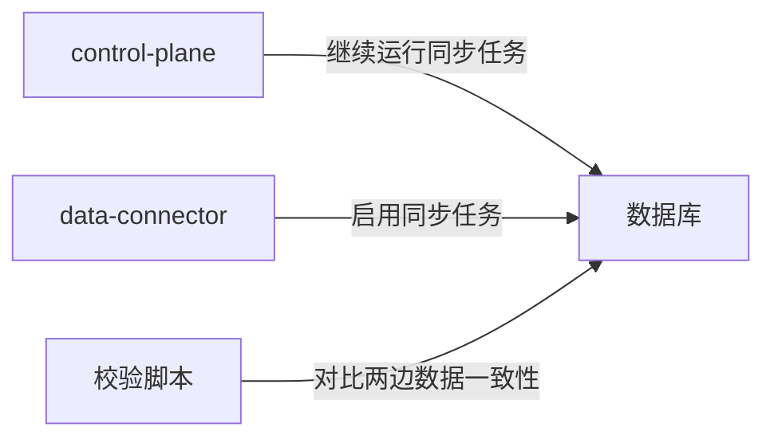
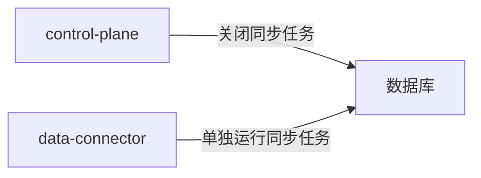

# iClaw 市场数据同步架构文档

## 1. 架构概述

### 1.1 系统定位
data-connector是iClaw平台的市场数据同步微服务，负责A股市场数据的定时采集、清洗、存储和分发，为平台提供稳定、可靠、准确的金融数据源。

### 1.2 架构演进
#### 旧架构（control-plane内置同步）
```
┌─────────────────────────────────────────┐
│ control-plane                           │
│  ┌──────────┐  ┌──────────┐  ┌────────┐ │
│  │ 用户认证 │  │ 计费管理 │  │ 同步任务 │ │
│  └──────────┘  └──────────┘  └────────┘ │
└─────────────────────────────────────────┘
           ▲
           │ PostgreSQL
           ▼
┌─────────────────────────────────────────┐
│               数据库                    │
└─────────────────────────────────────────┘
```

**旧架构问题：**
- 同步任务与业务逻辑耦合，扩展性差
- 资源竞争严重，同步任务影响control-plane性能
- 升级困难，同步逻辑变更需要重启整个control-plane
- 部署不灵活，无法独立扩容同步能力

#### 新架构（独立data-connector微服务）
```
┌─────────────────┐    ┌─────────────────┐
│ control-plane   │    │ data-connector  │
│ 业务逻辑层      │    │ 数据同步层      │
└─────────────────┘    └─────────────────┘
           ▲                  ▲
           │                  │ PostgreSQL
           ▼                  ▼
┌─────────────────────────────────────────┐
│               共享数据库                │
│  app.stock_basics                       │
│  app.stock_quotes                       │
│  app.stock_industry_relation            │
│  app.stock_concept_relation             │
│  app.stock_finance                      │
│  app.sync_task_logs                     │
└─────────────────────────────────────────┘
```

**新架构优势：**
- 职责分离，同步逻辑与业务逻辑完全解耦
- 独立部署，可根据需要单独扩容同步能力
- 独立升级，同步逻辑变更不影响control-plane运行
- 资源隔离，同步任务不会影响核心业务性能
- 更好的可观测性，独立监控同步任务运行状态

## 2. 核心功能

### 2.1 多数据源容错机制
- **数据源优先级**：AKShare → efinance → Tushare，自动降级
- **熔断机制**：单个数据源连续失败达到阈值后自动熔断
- **自动重试**：失败请求自动重试，支持指数退避
- **超时控制**：每个数据源请求都有超时保护

### 2.2 原子写入保障
- **临时表模式**：数据先写入临时表，校验通过后原子切换
- **事务支持**：全流程事务保障，失败自动回滚
- **数据校验**：写入前验证数据完整性，低于阈值自动拒绝
- **幂等性**：支持重复执行，不会产生脏数据

### 2.3 全链路审计日志
- 所有同步任务执行记录都写入`app.sync_task_logs`表
- 包含：任务名称、状态、同步条数、数据源、耗时、错误详情
- 支持历史回溯和问题排查
- 内置指标采集，支持Prometheus监控

### 2.4 内置调度器
- 基于APScheduler的分布式任务调度
- 支持cron表达式配置，与原control-plane完全一致
- 时区自动适配（默认Asia/Shanghai）
- 任务执行状态实时监控
- 分布式锁保障多实例部署时任务不重复执行

## 3. 同步任务说明

### 3.1 任务列表
| 任务名称 | 调度规则 | 描述 | 执行时长 | 数据量 |
|---------|----------|------|----------|--------|
| sync_stock_basics | 0 17 * * 1-5 | 交易日每日17:00同步股票基础信息 | < 5分钟 | 5000+条 |
| sync_stock_quotes | 0 9-15 * * 1-5 | 交易日交易时段每小时同步一次行情数据 | < 2分钟 | 5000+条/每小时 |
| sync_industry_concept | 0 18 * * 1-5 | 交易日每日18:00同步个股行业、概念板块关联关系 | < 10分钟 | 10000+条 |
| sync_finance_data | 0 10 1 1,4,7,10 * | 每季度首日同步财务数据 | < 30分钟 | 5000+条/季度 |

### 3.2 任务执行流程
```
1. 任务触发 → 2. 获取分布式锁 → 3. 记录任务开始日志
   ↓
4. 按优先级尝试数据源 → 5. 拉取数据 → 6. 数据清洗和校验
   ↓
7. 写入临时表 → 8. 数据完整性校验 → 9. 原子切换到正式表
   ↓
10. 记录成功日志 → 11. 释放分布式锁 → 12. 指标上报
```

### 3.3 异常处理流程
```
任一环节失败 → 记录错误日志 → 自动重试 → 超过重试次数
   ↓
事务回滚 → 释放分布式锁 → 告警通知 → 标记任务失败
```

## 4. 部署指南

### 4.1 环境要求
- Python 3.10+
- PostgreSQL 13+
- 内存：至少2GB
- CPU：至少2核
- 网络：能够访问互联网（拉取数据源）

### 4.2 快速部署

#### 方式一：Docker Compose部署（推荐）
```bash
# 1. 克隆代码
git clone <repository-url>
cd services/data-connector

# 2. 配置环境变量
cp .env.example .env
# 编辑.env文件，配置数据库连接等参数

# 3. 启动服务
docker-compose up -d

# 4. 验证服务状态
docker-compose ps
curl http://localhost:2131/health
```

#### 方式二：源码部署
```bash
# 1. 克隆代码
git clone <repository-url>
cd services/data-connector

# 2. 安装依赖
poetry install --only main

# 3. 配置环境变量
cp .env.example .env
# 编辑.env文件，配置数据库连接等参数

# 4. 启动服务
poetry run start
```

### 4.3 配置项说明
#### 核心配置
| 配置项 | 说明 | 默认值 |
|--------|------|--------|
| DB_URL | 数据库连接字符串 | 必填 |
| PORT | 服务端口 | 2131 |
| ENV | 运行环境 | prod |
| LOG_LEVEL | 日志级别 | INFO |

#### 调度器配置
| 配置项 | 说明 | 默认值 |
|--------|------|--------|
| SCHEDULER_ENABLED | 是否启用内置调度器 | true |
| SCHEDULER_TIMEZONE | 调度器时区 | Asia/Shanghai |

#### 同步任务配置
| 配置项 | 说明 | 默认值 |
|--------|------|--------|
| MIN_STOCK_COUNT | 股票数据最小校验阈值 | 4000 |
| MAX_RETRIES | 任务最大重试次数 | 3 |
| RETRY_DELAY | 重试初始延迟（秒） | 5 |
| MAX_CONCURRENT_TASKS | 最大并发任务数 | 2 |
| ENABLE_INCREMENTAL_SYNC | 是否启用增量同步 | true |

#### 数据源配置
| 配置项 | 说明 | 默认值 |
|--------|------|--------|
| DATA_SOURCE_PRIORITY | 数据源优先级 | akshare,efinance,tushare |
| DATA_SOURCE_TIMEOUT | 数据源请求超时（秒） | 30 |
| MAX_DATA_SOURCE_CONCURRENCY | 数据源最大并发请求数 | 5 |

### 4.4 数据库初始化
data-connector使用与control-plane相同的数据库表结构，无需额外初始化。如果是全新部署，需要先执行control-plane的数据库初始化脚本。

## 5. 迁移指南

### 5.1 迁移前准备
1. **备份数据**：备份所有股票相关业务表
   ```sql
   CREATE TABLE app.stock_basics_backup AS SELECT * FROM app.stock_basics;
   CREATE TABLE app.stock_quotes_backup AS SELECT * FROM app.stock_quotes;
   CREATE TABLE app.stock_industry_relation_backup AS SELECT * FROM app.stock_industry_relation;
   CREATE TABLE app.stock_concept_relation_backup AS SELECT * FROM app.stock_concept_relation;
   CREATE TABLE app.sync_task_logs_backup AS SELECT * FROM app.sync_task_logs;
   ```

2. **环境准备**：部署data-connector服务，配置正确的数据库连接

3. **功能验证**：在测试环境验证所有同步功能正常

### 5.2 迁移步骤（灰度发布）

#### 阶段一：并行运行（双写阶段）


**操作步骤：**
1. 启动data-connector服务，启用调度器
2. 此时两套系统同时运行同步任务，由于分布式锁的存在，任务不会重复执行
3. 运行数据校验脚本，对比两边写入的数据一致性
4. 并行运行至少2个交易日，确认数据完全一致

**验证指标：**
- 两边的sync_task_logs记录数量一致
- 股票基础信息数据完全一致
- 行情数据差异在可接受范围内（因为采集时间不同）
- 行业概念关联关系完全一致

#### 阶段二：停用旧系统


**操作步骤：**
1. 在control-plane的配置中设置`SYNC_TASKS_ENABLED=false`
2. 重启control-plane，确认同步任务已停止
3. 观察data-connector的运行状态，确认所有任务正常执行
4. 继续运行至少1个交易日，确认系统稳定

#### 阶段三：清理旧代码
1. 在后续版本中移除control-plane中的同步相关代码
2. 清理不再使用的配置项
3. 更新相关文档

### 5.3 回滚方案

#### 紧急回滚（出现重大问题时）
```bash
# 1. 停止data-connector服务
docker-compose stop data-connector

# 2. 在control-plane中重新启用同步任务
# 修改control-plane配置：SYNC_TASKS_ENABLED=true
# 重启control-plane

# 3. 验证同步任务恢复正常
curl http://control-plane:2130/health
```

#### 数据回滚（数据损坏时）
```sql
-- 从备份恢复数据
TRUNCATE TABLE app.stock_basics;
INSERT INTO app.stock_basics SELECT * FROM app.stock_basics_backup;

TRUNCATE TABLE app.stock_quotes;
INSERT INTO app.stock_quotes SELECT * FROM app.stock_quotes_backup;

TRUNCATE TABLE app.stock_industry_relation;
INSERT INTO app.stock_industry_relation SELECT * FROM app.stock_industry_relation_backup;

TRUNCATE TABLE app.stock_concept_relation;
INSERT INTO app.stock_concept_relation SELECT * FROM app.stock_concept_relation_backup;

TRUNCATE TABLE app.sync_task_logs;
INSERT INTO app.sync_task_logs SELECT * FROM app.sync_task_logs_backup;
```

## 6. 运维指南

### 6.1 常用操作

#### 查看服务状态
```bash
# Docker Compose部署
docker-compose ps
docker-compose logs -f --tail=100

# 源码部署
systemctl status data-connector
journalctl -u data-connector -f
```

#### 手动触发同步任务
```bash
# 触发股票基础信息同步
curl -X POST http://localhost:2131/api/v1/sync/stock-basics -H "Content-Type: application/json" -d '{"dry_run": false}'

# 触发股票行情同步
curl -X POST http://localhost:2131/api/v1/sync/stock-quotes -H "Content-Type: application/json" -d '{"dry_run": false}'

# 触发行业概念同步
curl -X POST http://localhost:2131/api/v1/sync/industry-concept -H "Content-Type: application/json" -d '{"dry_run": false}'

# 触发财务数据同步
curl -X POST http://localhost:2131/api/v1/sync/finance-data -H "Content-Type: application/json" -d '{"dry_run": false}'
```

#### 查看任务执行历史
```sql
-- 查看最近10次任务执行记录
SELECT task_name, status, data_count, duration, created_at, error_message
FROM app.sync_task_logs
ORDER BY created_at DESC
LIMIT 10;

-- 查看今日失败的任务
SELECT task_name, error_message, created_at
FROM app.sync_task_logs
WHERE status = 'failed' AND created_at >= CURRENT_DATE
ORDER BY created_at DESC;
```

### 6.2 监控和告警

#### 关键指标（Prometheus）
| 指标名称 | 说明 | 告警阈值 |
|----------|------|----------|
| data_connector_sync_task_total | 同步任务执行总次数 | - |
| data_connector_sync_task_success_total | 同步任务成功次数 | - |
| data_connector_sync_task_failed_total | 同步任务失败次数 | > 0持续5分钟 |
| data_connector_sync_task_duration_seconds | 同步任务执行时长 | > 30分钟 |
| data_connector_data_count | 每次同步的数据条数 | < 4000 |
| data_connector_datasource_requests_total | 数据源请求总次数 | - |
| data_connector_datasource_errors_total | 数据源请求失败次数 | > 10持续5分钟 |

#### 常用告警规则
```yaml
# 同步任务失败告警
alert: SyncTaskFailed
expr: increase(data_connector_sync_task_failed_total[1h]) > 0
for: 5m
labels:
  severity: critical
annotations:
  summary: "同步任务失败"
  description: "任务 {{ $labels.task_name }} 执行失败，请检查日志"

# 同步数据量不足告警
alert: SyncDataInsufficient
expr: data_connector_data_count < 4000
for: 5m
labels:
  severity: warning
annotations:
  summary: "同步数据量不足"
  description: "任务 {{ $labels.task_name }} 同步数据量仅为 {{ $value }}，低于阈值4000"

# 任务执行时间过长告警
alert: SyncTaskDurationTooLong
expr: data_connector_sync_task_duration_seconds > 1800
for: 5m
labels:
  severity: warning
annotations:
  summary: "同步任务执行时间过长"
  description: "任务 {{ $labels.task_name }} 执行时间超过30分钟"

# 服务不可用告警
alert: ServiceDown
expr: up{job="data-connector"} == 0
for: 1m
labels:
  severity: critical
annotations:
  summary: "data-connector服务不可用"
  description: "服务已经离线超过1分钟"
```

### 6.3 常见问题排查

#### Q1: 同步任务失败，日志显示"数据源请求超时"
**原因：** 网络问题或数据源服务不可用
**排查步骤：**
1. 检查服务器网络连接：`ping api.money.163.com`
2. 测试数据源API可用性：`curl "https://api.money.163.com/data/quote/hs.html"`
3. 调整超时配置：`DATA_SOURCE_TIMEOUT=60`
4. 如果是数据源本身问题，会自动降级到下一个优先级的数据源

#### Q2: 同步任务失败，日志显示"数据校验失败，记录数不足"
**原因：** 数据源返回的数据不完整
**排查步骤：**
1. 查看日志确认是哪个数据源返回的数据量不足
2. 手动访问数据源验证数据量
3. 临时调整阈值：`MIN_STOCK_COUNT=3000`（不推荐，建议等数据源恢复）
4. 检查是否有网络策略限制了数据请求

#### Q3: 任务重复执行
**原因：** 分布式锁失效或多个实例时间不同步
**排查步骤：**
1. 检查多个实例的系统时间是否一致：`date`
2. 检查是否有网络分区导致锁释放异常
3. 调整锁TTL配置：`DEFAULT_LOCK_TTL=3600`
4. 确保所有实例使用相同的时区配置

#### Q4: 内存占用过高
**原因：** 数据量过大或内存泄漏
**排查步骤：**
1. 查看内存使用情况：`docker stats data-connector`
2. 调整最大并发任务数：`MAX_CONCURRENT_TASKS=1`
3. 检查是否有内存泄漏，重启服务临时解决
4. 升级到最新版本，内存泄漏问题通常会在后续版本修复

## 7. API文档

### 7.1 通用返回格式
```json
{
  "success": true,
  "code": 200,
  "message": "操作成功",
  "data": {}
}
```

### 7.2 健康检查
**接口地址：** `GET /health`
**返回示例：**
```json
{
  "status": "ok",
  "timestamp": "2024-01-01T12:00:00Z",
  "version": "1.0.0",
  "scheduler_running": true,
  "database_connected": true
}
```

### 7.3 获取任务列表
**接口地址：** `GET /api/v1/sync/tasks`
**返回示例：**
```json
{
  "success": true,
  "data": [
    {
      "name": "sync_stock_basics",
      "description": "同步股票基础信息",
      "cron_expression": "0 17 * * 1-5",
      "next_run_time": "2024-01-01T17:00:00+08:00",
      "last_run_status": "success"
    }
  ]
}
```

### 7.4 触发同步任务
**接口地址：** `POST /api/v1/sync/{task_name}`
**请求参数：**
```json
{
  "dry_run": false, // 是否为试运行模式，不修改数据库
  "force": false // 是否强制执行，忽略分布式锁
}
```
**返回示例：**
```json
{
  "success": true,
  "data": {
    "task_id": "sync_stock_basics_20240101120000",
    "status": "running",
    "dry_run": false
  }
}
```

### 7.5 查询任务状态
**接口地址：** `GET /api/v1/sync/{task_id}/status`
**返回示例：**
```json
{
  "success": true,
  "data": {
    "task_id": "sync_stock_basics_20240101120000",
    "task_name": "sync_stock_basics",
    "status": "success",
    "start_time": "2024-01-01T12:00:00+08:00",
    "end_time": "2024-01-01T12:02:30+08:00",
    "duration": 150.5,
    "data_count": 5234,
    "data_source": "akshare",
    "error_message": null
  }
}
```

### 7.6 获取任务执行历史
**接口地址：** `GET /api/v1/sync/{task_name}/history?limit=10`
**返回示例：**
```json
{
  "success": true,
  "data": [
    {
      "id": 1234,
      "status": "success",
      "data_count": 5234,
      "duration": 145.2,
      "created_at": "2024-01-01T17:00:00+08:00",
      "data_source": "akshare"
    }
  ]
}
```

## 8. 性能指标

### 8.1 基准性能
| 任务名称 | 平均执行时长 | 峰值内存占用 | CPU使用率 |
|---------|--------------|--------------|-----------|
| 股票基础信息 | 2分30秒 | 256MB | 80% |
| 股票行情 | 45秒 | 128MB | 50% |
| 行业概念 | 6分钟 | 384MB | 120% |
| 财务数据 | 15分钟 | 512MB | 150% |

### 8.2 资源配置建议
| 部署规模 | CPU | 内存 | 并发任务数 |
|---------|-----|------|------------|
| 小型（日活<1万） | 2核 | 4GB | 2 |
| 中型（日活1-10万） | 4核 | 8GB | 3 |
| 大型（日活>10万） | 8核 | 16GB | 5 |

## 9. 版本历史

| 版本 | 日期 | 变更内容 |
|------|------|----------|
| 1.0.0 | 2024-01-01 | 初始版本，从control-plane拆分独立 |
| 1.0.1 | 2024-01-15 | 优化内存使用，修复分布式锁问题 |
| 1.1.0 | 2024-02-01 | 新增增量同步功能，性能提升30% |
